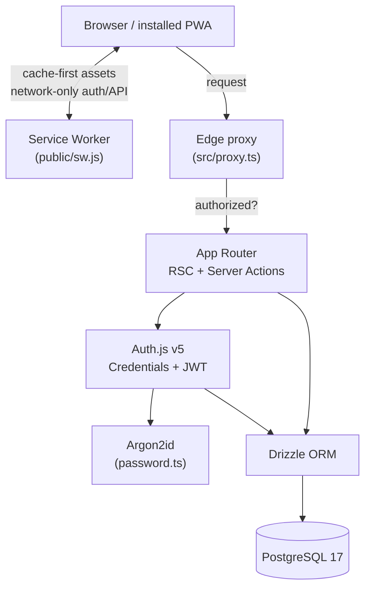

# Architecture

[← Back to README](../README.md)

## Overview

A single Next.js 16 application (App Router) backed by PostgreSQL. Rendering is server-first (React Server Components + Server Actions); the client bundle is only what interactivity requires.



## Request flow

1. **Edge proxy** (`src/proxy.ts`) runs first on protected paths. It uses only the edge-safe auth config (no DB, no native crypto) to check the session and redirect unauthenticated users to `/login`.
2. **App Router** renders the page as a Server Component. Protected layouts/pages re-read the session server-side (`getCurrentSession`) as defense in depth.
3. **Server Actions** handle mutations (register, login, sign-out) — no separate API layer for forms.
4. **Drizzle ORM** executes type-safe queries against Postgres via a pooled `postgres-js` client.

## Authentication design

Auth.js v5 is split across two runtimes so the edge middleware stays lightweight:

| File                     | Runtime   | Responsibility                                                                                                        |
| ------------------------ | --------- | --------------------------------------------------------------------------------------------------------------------- |
| `src/lib/auth/config.ts` | edge-safe | `pages`, session strategy, `authorized`/`jwt`/`session` callbacks. **No DB, no argon2.**                              |
| `src/lib/auth/index.ts`  | Node      | Full `NextAuth()` with the Credentials provider (needs DB + argon2). Exports `handlers`, `auth`, `signIn`, `signOut`. |
| `src/proxy.ts`           | edge      | Imports only `config.ts`; enforces route protection.                                                                  |

Key properties:

- **JWT sessions** — required for the Credentials provider; the user id is attached in the `jwt` callback and surfaced in `session`.
- **Argon2id hashing** (`src/lib/auth/password.ts`) with OWASP parameters.
- **User-enumeration resistance** — `fakeVerifyPassword` runs a dummy verify when no user matches, equalizing response timing.
- **Resilient reads** — `getCurrentSession` (`src/lib/auth/session.ts`) catches an undecryptable-cookie error (e.g. after `AUTH_SECRET` rotation) and returns `null` instead of throwing, while re-throwing Next.js control-flow signals via `unstable_rethrow`.

## Error handling

- `src/app/error.tsx` — segment error boundary (recoverable, keeps layout).
- `src/app/global-error.tsx` — root boundary; self-contained so it renders even if styling/components fail.
- `src/app/not-found.tsx` — 404.

## Security model

- Passwords never stored in plaintext (Argon2id only).
- Auth cookies are HTTP-only, encrypted JWTs (Auth.js defaults).
- Hardened response headers (`X-Content-Type-Options`, `X-Frame-Options: DENY`, `Referrer-Policy`, `Permissions-Policy`) set in `next.config.ts`.
- Environment validated at boot (`src/lib/env.ts`) — the app refuses to start with a missing/invalid secret or DB URL.
- Service worker **never caches** authenticated HTML or API responses (see [PWA](pwa.md#caching-strategy)).
- Sensitive files are git- and docker-ignored; the Docker image runs as a non-root user.

## Project structure

```
src/
├── app/
│   ├── (auth)/                  # login + register (shared centered layout)
│   ├── (dashboard)/             # protected area, wrapped in the app shell
│   │   ├── layout.tsx           #   auth guard + <AppShell>
│   │   ├── dashboard/           #   /dashboard
│   │   └── settings/            #   /settings
│   ├── api/
│   │   ├── auth/[...nextauth]/  # Auth.js endpoints
│   │   └── health/             # DB-backed liveness probe
│   ├── manifest.ts             # PWA manifest → /manifest.webmanifest
│   ├── offline/                # SW offline fallback
│   ├── icon.png · apple-icon.png
│   ├── error.tsx · global-error.tsx · not-found.tsx
│   └── layout.tsx · page.tsx · globals.css
├── components/
│   ├── auth/                    # forms, submit button, sign-out
│   ├── pwa/                     # service-worker register, install prompt
│   ├── shell/                   # app-shell, sidebar-nav
│   └── ui/                      # shadcn/ui primitives
├── db/
│   ├── schema.ts · index.ts · migrate.ts · seed.ts
├── lib/
│   ├── auth/                    # config · index · password · actions · session · form-state
│   ├── shell/nav.ts            # sidebar navigation config
│   ├── validations/            # Zod schemas
│   ├── env.ts · utils.ts
├── proxy.ts                     # edge route protection
└── types/next-auth.d.ts         # session typing
```

## Key decisions

- **TypeScript 5.9, ESLint 9** (not the newest majors) — chosen for full toolchain compatibility over bleeding edge.
- **Turbopack everywhere** (dev + build) — the PWA is hand-rolled to avoid a Webpack-only service-worker plugin.
- **`proxy.ts`, not `middleware.ts`** — Next 16 renamed the convention; the old name is deprecated.
- **Credentials-only auth, adapter-ready schema** — OAuth can be added without a migration rewrite.
