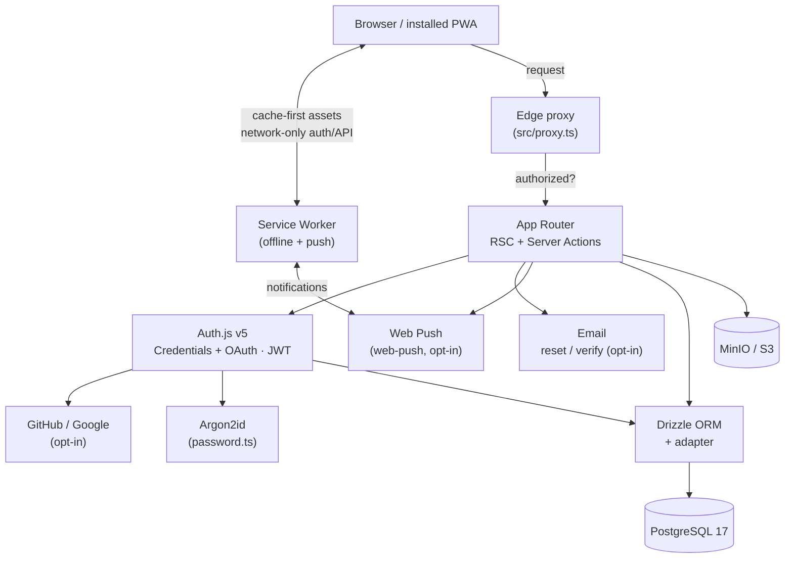

# Architecture

[← Back to README](../README.md)

## Overview

A single Next.js 16 application (App Router) backed by PostgreSQL. Rendering is server-first (React Server Components + Server Actions); the client bundle is only what interactivity requires.



## Production container topology

The production stack ([`docker-compose.prod.yml`](../docker-compose.prod.yml))
is a private bridge network with **one public gateway** (`app`). Postgres and
MinIO are never exposed; short-lived one-shot containers handle migrations and
bucket setup, and two sidecars run [backups](backups.md).

```text
                              Internet (HTTPS)
                                     │
                          ┌──────────▼───────────┐
                          │   Cloudflare Tunnel   │  outbound-only; no open ports
                          └──────────┬───────────┘
                                     │  :3000
┌────────────────────────────────────────────────────────────────────────────┐
│  docker-compose.prod.yml   (private bridge network)                          │
│                                                                              │
│                          ┌────────────────────┐                             │
│                          │    app  (Next.js)  │   the only public gateway    │
│                          └───────┬─────┬──────┘                             │
│                        SQL       │     │      S3 API                         │
│                  ┌───────────────┘     └───────────────┐                    │
│          ┌───────▼────────┐                    ┌────────▼────────┐           │
│          │  db  (PG 17)   │                    │ minio (objects) │           │
│          │  vol: pgdata   │                    │ vol: miniodata  │           │
│          └───▲───────▲────┘                    └───▲────────▲────┘           │
│    one-shot  │       │ nightly pg_dump             │        │  mc mirror     │
│  ┌───────────┴──┐ ┌──┴───────────┐        ┌────────┴─┐ ┌────┴──────────┐    │
│  │   migrate    │ │  db-backup   │        │minio-init│ │ minio-backup  │    │
│  │ (db:migrate) │ │  (nightly)   │        │ (bucket) │ │  (interval)   │    │
│  └──────────────┘ └──────┬───────┘        └──────────┘ └──────┬────────┘    │
│                          │                                    │             │
│                          ▼                                    ▼             │
│                  ./backups/postgres                    ./backups/minio      │
│                  (host bind mount — see docs/backups.md; excluded from git) │
└────────────────────────────────────────────────────────────────────────────┘
```

Startup ordering is enforced with `depends_on` health/completion conditions:
`db` healthy → `migrate` completes → `minio-init` completes → `app` starts.

## Request flow

1. **Edge proxy** (`src/proxy.ts`) runs first on protected paths. It uses only the edge-safe auth config (no DB, no native crypto) to check the session, redirect unauthenticated users to `/login`, and redirect users lacking a required role (`ROLE_REQUIRED`) to `/403`.
2. **App Router** renders the page as a Server Component. Protected layouts/pages re-read the session server-side (`getCurrentSession`) as defense in depth.
3. **Server Actions** handle mutations (register, login, sign-out) — no separate API layer for forms.
4. **Drizzle ORM** executes type-safe queries against Postgres via a pooled `postgres-js` client.

## Authentication design

Auth.js v5 is split across two runtimes so the edge middleware stays lightweight:

| File                           | Runtime   | Responsibility                                                                                                                                    |
| ------------------------------ | --------- | ------------------------------------------------------------------------------------------------------------------------------------------------- |
| `src/lib/auth/config.ts`       | edge-safe | `pages`, session strategy, `authorized`/`jwt`/`session` callbacks. **No DB, no argon2.**                                                          |
| `src/lib/auth/index.ts`        | Node      | Full `NextAuth()` with the Credentials provider (needs DB + argon2). Exports `handlers`, `auth`, `signIn`, `signOut`.                             |
| `src/proxy.ts`                 | edge      | Imports only `config.ts`; enforces route protection + role gating.                                                                                |
| `src/lib/auth/rbac.ts`         | Node      | Server-side role guards: `requireRole` / `requireAnyRole` / `hasRole` (throw `ForbiddenError`).                                                   |
| `src/lib/auth/client-rbac.tsx` | client    | `useRole()` hook + `<RequireRole>` for cosmetic gating (server checks stay authoritative).                                                        |
| `src/lib/auth/providers.ts`    | Node      | Which OAuth providers are configured (`isGithubConfigured` / `isGoogleConfigured`) — booleans only, never secrets. See [OAuth](oauth.md).         |
| `src/lib/auth/tokens.ts`       | Node      | Purpose-agnostic single-use hashed tokens (mint / SHA-256 / time-safe verify). Backs invites, [password reset, and email verification](email.md). |
| `src/lib/auth/roles.ts`        | Node      | Bootstrap role for new OAuth users (first user → `admin`, rest → `member`), via `events.createUser`.                                              |
| `src/lib/push/`                | Node      | `web-push` wrapper (`sendPushNotification` / `notifyRole`) — safe no-op when VAPID is unset. See [Features → Web Push](features.md).              |

Key properties:

- **JWT sessions kept even with the OAuth adapter** — Auth.js would default to
  database sessions once a `DrizzleAdapter` is present; the config keeps
  `strategy: 'jwt'` explicitly so `proxy.ts`'s edge route protection stays a
  zero-DB-round-trip JWT check. The adapter lives only in the Node config,
  never the edge one. See [OAuth](oauth.md).
- **User id on the JWT** — attached in the `jwt` callback and surfaced in `session`.
- **Roles on the token** — the `jwt` callback attaches a `roles: string[]` claim (self-healing: a stale token missing it re-fetches once and back-fills). `proxy.ts` gates route prefixes on it via `ROLE_REQUIRED`; server actions assert with `requireRole`. See [Features → Access control](features.md#access-control-rbac).
- **Argon2id hashing** (`src/lib/auth/password.ts`) with OWASP parameters.
- **User-enumeration resistance** — `fakeVerifyPassword` runs a dummy verify when no user matches, equalizing response timing.
- **Resilient reads** — `getCurrentSession` (`src/lib/auth/session.ts`) catches an undecryptable-cookie error (e.g. after `AUTH_SECRET` rotation) and returns `null` instead of throwing, while re-throwing Next.js control-flow signals via `unstable_rethrow`.

## Error handling

- `src/app/error.tsx` — segment error boundary (recoverable, keeps layout).
- `src/app/global-error.tsx` — root boundary; self-contained so it renders even if styling/components fail.
- `src/app/not-found.tsx` — 404.

## Security model

- Passwords never stored in plaintext (Argon2id only).
- Auth cookies are HTTP-only, encrypted JWTs (Auth.js defaults).
- **Rate limiting** on auth: the server actions cap attempts for a friendly
  message, and the credentials `authorize` callback caps them again so the raw
  `/api/auth/callback/credentials` endpoint can't be brute-forced by bypassing
  the UI (`src/lib/rate-limit.ts`). The default limiter is in-memory
  (single-instance); swap in a shared store (Upstash) for multi-instance.
- **Content-Security-Policy** with a per-request nonce + `strict-dynamic` in
  production (looser in dev for HMR), plus `Strict-Transport-Security`,
  `X-Content-Type-Options`, `X-Frame-Options: DENY`, `Referrer-Policy`, and
  `Permissions-Policy`. CSP is set in `proxy.ts`; the static headers in
  `next.config.ts`. `X-Powered-By` is disabled.
- **Registration** relies on the unique index as the source of truth — a
  concurrent duplicate signup is caught (`23505`) and returns a clean error, not
  a 500. Emails are stored lower-cased with a functional `lower(email)` unique
  index for case-insensitive uniqueness.
- Environment validated at boot (`src/lib/env.ts`) — the app refuses to start
  with a missing/invalid secret or DB URL, or with `EMAIL_ENABLED=true` but no
  SMTP provider configured.
- **RBAC** — roles live only in the DB + JWT claim. Edge gating (`proxy.ts`) is
  a fast JWT check; server actions and the admin panel re-assert with
  `requireRole` against `getCurrentSession()` (DB-backed if the token is stale),
  so the client helpers are cosmetic and can't grant access.
- **File uploads** — size, MIME-type, and per-user quota are all validated
  server-side before anything is written to storage. MinIO has no public
  ingress; the app is the only path to it (`src/app/api/files/[id]/route.ts`
  checks ownership on every download — a non-owner gets the same 404 whether
  the file exists or not).
- **Invite claim** — admin-created accounts are passwordless and claimable only
  with a single-use token whose SHA-256 hash (not the token) is stored, is
  time-safe compared, expires in 7 days, and is cleared on use. A wrong/expired
  invite returns the same generic message as an existing account (no enumeration).
- **Email is opt-in** — off unless `EMAIL_ENABLED=true` **and** a provider is set;
  `sendEmail` is a no-op otherwise and never throws on send failure, so mail can't
  block a mutation. `nodemailer` is loaded lazily — never bundled when off, never
  at the edge.
- Service worker **never caches** authenticated HTML or API responses (see
  [PWA](pwa.md#caching-strategy)).
- Sensitive files are git- and docker-ignored; the Docker image runs as a
  non-root user.

### Session strategy & revocation

Sessions are **stateless JWTs**, so they cannot be revoked server-side before
expiry — there is no "log out all devices" or instant ban. This is the right
default for a credentials app (no DB round-trip per request). If you need
revocation, switch to database sessions: enable `DrizzleAdapter(db)`, change the
session strategy to `"database"`, and the existing `sessions` table is used.

## Project structure

```
src/
├── app/
│   ├── (auth)/                  # login · register · forgot/reset-password · verify-email
│   │                           #   (shared centered layout + theme toggle)
│   ├── (dashboard)/             # protected area, wrapped in the app shell
│   │   ├── layout.tsx           #   auth guard + <SessionProvider> + <AppShell>
│   │   ├── dashboard/           #   /dashboard
│   │   └── settings/            #   /settings + admin user-management panel
│   ├── 403/                     # forbidden page (role-gated redirects land here)
│   ├── api/
│   │   ├── auth/[...nextauth]/  # Auth.js endpoints
│   │   ├── files/[id]/         # ownership-checked file download (streams from MinIO)
│   │   └── health/             # DB-backed liveness probe
│   ├── manifest.ts             # PWA manifest → /manifest.webmanifest
│   ├── offline/                # SW offline fallback
│   ├── icon.png · apple-icon.png
│   ├── error.tsx · global-error.tsx · not-found.tsx
│   └── layout.tsx · page.tsx · globals.css
├── components/
│   ├── auth/                    # forms · avatar-upload · connected-accounts · oauth-buttons
│   │                           #   · verification-banner · forgot/reset-password forms
│   ├── files/                   # "My Files" panel (upload/list/download/delete)
│   ├── push/                    # notifications-panel (subscribe/unsubscribe)
│   ├── pwa/                     # service-worker register, install prompt
│   ├── shell/                   # app-shell (brand + theme toggle), sidebar-nav
│   ├── theme/                   # theme-provider · theme-toggle (next-themes)
│   └── ui/                      # shadcn/ui primitives
├── db/
│   ├── schema.ts · index.ts · migrate.ts · seed.ts
├── lib/
│   ├── auth/                    # config · index · password · actions · admin-actions · session
│   │                           #   · form-state · rbac · client-rbac · invite · providers · roles
│   │                           #   · tokens · verification-tokens · recovery-actions
│   │                           #   · account-actions · email-verification · verification-guard
│   ├── email/                   # index (gate + sendEmail) · transport (SMTP) · templates
│   ├── push/                    # index (web-push send + prune) · actions (save/remove sub)
│   ├── storage/                 # client (S3/MinIO) · validation · actions (upload/list/delete)
│   ├── shell/nav.ts            # sidebar navigation config
│   ├── validations/            # Zod schemas
│   ├── env.ts · utils.ts
├── proxy.ts                     # edge route protection + role gating
└── types/next-auth.d.ts         # session + roles typing
```

## Key decisions

- **TypeScript 5.9, ESLint 9** (not the newest majors) — chosen for full toolchain compatibility over bleeding edge.
- **Turbopack everywhere** (dev + build) — the PWA is hand-rolled to avoid a Webpack-only service-worker plugin.
- **`proxy.ts`, not `middleware.ts`** — Next 16 renamed the convention; the old name is deprecated.
- **Credentials + OAuth, one identity system** — GitHub/Google run through the
  same Auth.js instance and `users` table as the Credentials provider (not a
  second auth system), with JWT sessions kept. See [OAuth](oauth.md).
- **Everything external is opt-in** — [OAuth](oauth.md), [email](email.md)
  (reset/verify), and Web Push are each inert until their env vars are set, so a
  fork boots zero-config and turns features on as needed.
