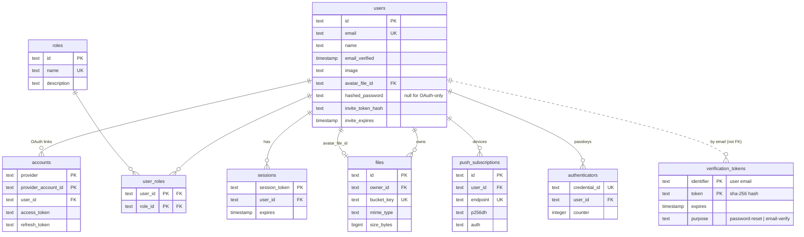

# Database

[← Back to README](../README.md)

PostgreSQL 17 accessed through [Drizzle ORM](https://orm.drizzle.team) with a `postgres-js` driver.

### Entity-Relationship Diagram



### Schema Tables

| Table                 | Purpose                                                   |
| --------------------- | --------------------------------------------------------- |
| `users`               | Accounts with password, email, invites, avatar            |
| `accounts`            | OAuth provider links (GitHub/Google)                      |
| `sessions`            | Database sessions (unused under JWT strategy)             |
| `verification_tokens` | Single-use tokens for password reset & email verification |
| `authenticators`      | WebAuthn/passkey credentials                              |
| `roles`               | Roles: admin, member, viewer                              |
| `user_roles`          | Many-to-many users ↔ roles                                |
| `files`               | Uploaded file metadata + S3 storage                       |
| `push_subscriptions`  | Web Push subscriptions per device                         |

### Migration Workflow

```bash
pnpm db:generate    # generates SQL migration
pnpm db:migrate     # applies pending migrations
pnpm db:push        # direct schema push (prototyping)
pnpm db:studio      # visual DB browser
```

**Key files:**

- `src/db/migrate.ts:23` - Migration runner (Docker entrypoint)
- `src/db/seed.ts` - Idempotent seed (roles admin/member/viewer + demo admin user)

### Important Features

#### Role-Based Access Control

- Roles carried as `roles: string[]` claim on JWT (no DB round-trip to read)
- Edge gating via `proxy.ts`
- Server-side guards in `src/lib/auth/rbac.ts`

#### File Storage

- MinIO (S3-compatible) for object storage
- Postgres `files` table for metadata
- Ownership-checked downloads
- Profile photos support via `users.avatar_file_id`

#### Security Features

- Passwords stored with Argon2id
- Email uniqueness enforced (case-insensitive)
- Verification tokens stored as SHA-256 hashes
- Invite-based account claim (passwordless)

### Database Commands

| Command             | Description                                          |
| ------------------- | ---------------------------------------------------- |
| `pnpm docker:db`    | Start local Postgres                                 |
| `pnpm docker:minio` | Start local MinIO with bucket                        |
| `pnpm db:migrate`   | Apply migrations                                     |
| `pnpm db:seed`      | Seed demo user (`demo@example.com` / `Password123` ) |

### Production Setup

See [deployment.md](deployment.md) for production Docker configuration.
